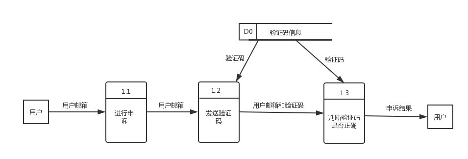

### 一.专题分析

#### 1.1选题的目标和意义

​	随着互联网进一步发展，越来越多的高校开始探索如何将传统教学和互联网相结合，由此诞生了网上慕课等一系列在线学习网站，服务一些想学习但苦于条件的大众，网上答题系统着眼于课下练习，利用互联网方便快捷的特性，提供学生一个在线练习题目的机会，并提供客观题评阅功能，如果遇到好的题目，也支持题目收藏功能，方便同学再次查阅，练习。在线答题系统旨在提供一个平台，题库来源于往年题目，面向大一大二等学习通识类课程的同学，方便他们练习，提升自我。

#### 1.2功能需求描述

##### 	1.2.1功能需求

​	由于时间原因。这次小组实验设计的在线答题系统提供的服务有限，系统侧重于给用户提供练习题，方便用户在线练习，查看答案，收藏题目等行为。以下是用户可以使用的功能：

1. 用户可以在线答题

2. 用户可以收藏题目

3. 用户可以选择不同科目，不同试卷

4. 用户可以根据自己的喜好选择按试卷做题或者随机做题

5. 用户可以查询已做题数量

6. 用户可以注册，修改密码及邮箱，忘记密码后可以进行申诉找回密码


##### 1.2.2性能需求

​	该系统侧重于学生平时练习和考前复习巩固使用，因为目标用户为大一大二学生，需要存储大量的试题信息，该系统需要同时满足题目的增加，编辑，删除，答题，评阅等功能，应保证正常的操作做出的反应在极短的时间内，以下是系统必须满足的约束：

1. 查询应该在1s之内
2. 新建用户，发送验证码整个流程应该在3分钟之内完成
3. 删除信息应该在1s之内

##### 1.2.3数据要求

系统中的对象有用户对象，试题对象，试卷对象。

需要处理的信息有：

1. 登录时检查输入账号是否存在，密码是否正确
2. 提供注册功能

3. 提供密码的更改，找回功能
4. 用户可以在线答题
5. 提供客观题的评阅功能
6. 用户可以收藏和移去收藏


  系统应该产生的信息：

1. 查询数据库中试卷信息，提供给用户
2. 查询每个试卷中的题目信息，提供给用户 
3. 查询每个题目的细节信息，提供给用户
4. 注册时发送验证码给用户
5. 处理用户的作答结果，返回答案给用户
6. 返回用户的收藏题目

#### 1.3功能分析建模

##### 	1.3.1系统流程图

​	系统提供用户的注册，修改密码，在遗忘密码情况下修改密码等功能，该功能在经过用户注册程序，用户修改程序，账号申诉程序与储存用户信息的数据库链接，进行数据库的增，改操作。用户进行试题选择，系统查询数据库后，经过试卷生成程序，展示给用户一套完整的试卷，在用户答题之后，经过答案核对程序，在查询数据库之后，展示给用户答题结果及解析。如果用户希望收藏题目并增加笔记，经过题目收藏程序，改变用户信息数据库，添加用户收藏。

​	系统流程图如下：

##### 

​								1.3.1-1系统流程图

​	关键模块：

​	试卷生成程序：在接收到用户选择科目后，查询数据库中相应的的试题信息，组成试卷，展示给用户

	

​								1.3.1-2 按试卷做题流程图

​	注册模块：后端在收到用户的信息后，调用发送验证程序，收到完整注册信息后，检查验证码信息，进行注册


​							1.3.1-3 用户注册流程图

​	答案核对程序：在接收到用户答题结果后，查询数据库中试题对应答案，核对答案后，展示给用户。

​	

​							1.3.1-4 核对答案流程图

​	用户申诉账号模块：在接收到用户信息后，调用发送验证码程序，接受到完整信息后，查询验证码是否正确，更改密码。



​							1.3.1-5 用户申诉流程图						

​	随机答题模块：在用户选择随即答题后，生成随机数返试题返回给用户。

​							1.3.1-6 随机答题流程图

##### 	1.3.2功能模型

​	用户输入用户名或者邮箱和密码进行登录，如果用户忘记密码，凭借邮箱和验证码修改密码，用户选择答题模式后选择答题科目，然后选择想要答题试卷，根据试卷ID，系统筛选试题信息，提供题目给用户作答，根据题目id，系统在数据库中核对答案，用户如果希望收藏题目，则将收藏题目id保存至系统数据库，并生成对应用户的收藏夹。

​	功能模型如下：

##### 

​							1.3.2-1 数据流图

##### 	1.3.3数据模型

​	用户具有用户名，邮箱，密码和收藏夹等属性，题目有学科，题目id，答案，解析，所属试卷id，所属试卷年份属性，用户可以收藏题目，也可做题目。1个用户可以收藏多个题目，可以做多个题目，不同的用户可以做一个题目，不同的用户可以收藏一个题目，所以用户和题目是多对多的关系

​	数据模型如下：

​	

​							1.3.3-1 实体联系图

##### 	1.3.4行为模型

​	程序处于闲置状态，用户点击注册进入注册事件，输入注册信息，跳转到接受验证码阶段如果验证成功，添加用户信息，进入页面，用户选择答题或查看收藏，选择答题则选择答题科目，然后选择试卷，进行答题，答题之后可以查看答题结果，如果有需要用户可以进行收藏题目，在收藏夹中查看收藏题目信息。

​	行为模型如下：

​							1.4.4-1 状态转换图


#### 1.4非功能需求

​	空间：应该支持较多终端的同时访问，同时应保证后端服务平稳，稳定地运行在服务器上，并对于每次异常退出生成日志。

#### 1.5界面与接口需求

##### 	1.5.1界面需求

​	界面设计应该美观大方，简洁，同时应该有一定的审美基础，用户界面应该简单明了，对用户友好，易操作。不应该有过多的跳转界面，应及时对用户的操作作出响应，避免用户等待时间过长。

##### 	1.5.2接口需求

​	由于系统是网页的形式，采用了前后端分离的Restful式架构，前后端信息仅通过Ajax传输，实现了模块之间较低的耦合程度。根据功能定义接口需求如下：

1. 后端提供登录接口
2. 后端提供注册接口
3. 后端提供发送邮件接口
4. 后端提供检查用户名是否重复接口
5. 后端提供检查邮箱是否重复接口
6. 后端提供注销接口
7. 后端提供更改密码接口
8. 后端提供忘记密码接口
9. 后端提供获得科目接口
10. 后端提供"无尽模式"接口
11. 后端提供选择卷子接口
12. 后端提供获得试题接口
13. 后端提供检查答案接口
14. 后端提供加入收藏接口
15. 后端提供获得用户收藏接口

### 二.专题设计

#### 2.1总体设计

##### 	2.1.1方案设计

​	方案一：采取前后端不分离的写法，每次数据传输到后端，后端返回一个新的页面。

​	方案二：采取前后端分离的写法，前端和后端是独立的模块，彼此分离，互不影响，数据交互采取ajax方法。

​	方案一是一般网站的架构方法，好处在于简单，方便，但是各部分耦合度较高，不符合软件工程方法学对模块之间复杂度的要求。方案二采取Ajax交互的方式，前后端仅有数据的交互，彼此分离，是一种数据耦合，符合软件工程方法学对模块间耦合度的要求，且可以合理分工，采用这种方式。

##### 	2.1.2软件结构设计

​	整个系统分成两个大的模块，分别是用户信息管理模块和答题模块，用户信息管理模块又可以细分成登录，注册，修改，申诉等四个模块，答题模块可以细分到答题，选题模块。答题模块和信息管理模块相对独立，并无干扰。


​							2.1.2-1 层次方框图	

##### 	2.1.3数据库设计

​	考虑到用户信息有用户名，邮箱，密码，收藏夹，验证码等，由于采用django默认的用户信息管理系统所有设计的用户信息表如下。

​	用户表(User)：

| Field    | Type        | Key  | Default |
| -------- | ----------- | ---- | ------- |
| Id       | int(11)     | Pri  | <null>  |
| username | varchar(30) |      | <null>  |
| password | varchar(30) |      | <null>  |
| E-mail   | varchar(30) |      | <null>  |

​	由于支持发送验证码功能，所以设计邮箱-验证码表：

| Field    | Type        | Key  | Default |
| -------- | ----------- | ---- | ------- |
| id       | int(11)     | Pri  | <null>  |
| email    | varchar(30) |      | <null>  |
| Validate | varchar(4)  |      | <null>  |

​	用户具有收藏题目的功能，所以设计用户收藏表：

| Field    | Type        | Key  | Default |
| -------- | ----------- | ---- | ------- |
| id       | int(11)     | Pri  | <null>  |
| username | User        |      | <null>  |
| Problem  | problem     |      | <null>  |
| Note     | varchar(60) |      | <null>  |

​	考虑到卷子有科目，科目代号，年份，题目数量，试卷描述，所以设计试卷表：

| Field        | Type        | Key  | Default |
| ------------ | ----------- | ---- | ------- |
| id           | int(11)     | Pri  | <null>  |
| paper_title  | varchar(30) |      | <null>  |
| paper_course | varchar(30) |      | <null>  |
| paper_type   | int(11)     |      | <null>  |
| paper_year   | int(5)      |      | <null>  |

​	考虑到试题有试题类型，试题描述，试题题目，试题答案，试题顺序，外键是所属卷子，所以设计试题表：

| Field      | Type        | Key  | Default |
| ---------- | ----------- | ---- | ------- |
| id         | int(11)     | Pri  | <null>  |
| paper      | Paper       |      | <null>  |
| pro_des    | varchar(30) |      | <null>  |
| pro_detail | varchar(50) |      | <null>  |
| pro_ans    | varchar(50) |      | <null>  |
| pro_order  | int(11)     |      | <null>  |
| pro_type   | int(11)     |      | <null>  |

​	考虑到数据表中无法存储数组，故将每个题目的选项与题目相关联，试题是外键，设计选项-题目表：

| Field   | Type        | Key  | Default |
| ------- | ----------- | ---- | ------- |
| id      | int(11)     | Pri  | <null>  |
| option  | varchar(11) |      | <null>  |
| problem | Problem     |      | <null>  |
| order   | int(11)     |      | <null>  |

#### 2.2详细设计

##### 	2.2.1程序结构设计

以下是主要功能模块的程序流程图：

1.注册功能


​							2.2.1-1 用户注册模块程序流程图

2.登录功能


​							2.2.1-2 用户登录模块程序流程图

3.账号申诉功能


​							2.2.1-3 账号申诉模块程序流程图

4.修改个人信息功能


​							2.2.1-4 修改信息模块程序流程图

5.答题及更新收藏夹模块


​							2.2.1-5 用户答题及更新收藏夹模块程序流程图

##### 	2.2.2接口设计

根据前端提供的接口需求，设计接口定义如下

### 错误信息

当请求出错时，所有api返回如下错误信息。

- Response 200

```
{
  “success": 0,
  "err_msg": err_msg
}
```

### 用户组

用户使用账号密码登录。

更新了加密方式，采用django自带的登录模式

#### 通过用户名登录 `POST {base_url}/user/login`

- Requset(application/json)

  ```json
  {
    //email or username is all ok 
    "email": "qwer@qaz", //FE do the regex check and back end do also
    "username": "zwexcelwang",
    "password":"madjadflas"  
  }
  ```

- Response 200

  ```json
  {
    "success": 1,
    "username":"zwexcelwang"
  }
  ```

#### 注册用户 `POST{base_url}/user/register`

- Request(application/json)

  ```json
  {
    "email": "qwer@qaz", //FE do the Regex Filter
    "username":"zwexcelwang",  // username.length < 20 && FE check BE dosen't check
    "password":"askldfaffadk"  //  8 < length < 30
     "validate": "1234"
  }
  ```

- Response 200

  ```json
  {
  	"success":1,
  	"username": "zwexcelwang"
  }
  ```

#### 检查用户名或邮箱是否重复`GET{base_url}/user/register`

- Requset(application/json)

```json
{
  	//二选一
	"username": "zwexcelwang",
	"email": "qwer@qaz"
}
```

- Response 200

```json
{
	"success": 1,
	"status": 0 // 1 for exists && 0 for not exist
}
```

#### 发送邮箱验证码`POST{base_url}/user/sendEmail`

- Request (application/json)

```json
{
    "email": "qwer@qaz"
}
```

- Response 200

```json
{
    "success": 1 //cant send again in 30 seconds
}
```

#### 用户登出`DELETE{base_url}/user/logout`

- Request(application/json)

```json
{
	"username": "zwexcelwang"
}
```

- Response 200

```json
{
  "success":1
}
```

#### 修改密码`POST{base_url}/user/password`

- Request (application/json)

```json
{
  "username":"zwexcelwang",
  "oldPassword":"mdadfjalfdj", // 8<length < 30
  "newPassword":"adjsflajadf", // 8<length < 30
}
```

- Response(application/json)

```json
{
	"success" : 1
}
```

#### 忘记密码`PUT{base_url}/user/password`

- Requset(application/json)

```json
{
	"username": "zwexcelwang",
  	"email": "qwer@qaz",
    "validate":"1234",
	"newPassword": "adfjadsag", // 8<length <30
}
```

- Response 200

```json
{
  "success": 1
}
```

### 答题模块

User chooses the course  =>  chooses years =>choose paper => gets problems  

#### 选择学科`GET{base_url}/course/course`

* Request (application/json)

```json
{
  "course": course_type  // 1 for advanced math 2 for linear algebra etc can discuss -1 for all paper
}
```

- Response 200

```json
{
    "success" : 1,
  	"num" : 10  //stands for the paper's number
  	"papers": [{
    	"paper_year" : 2016,
  		"paper_title" : "2016 Advanced Mathmatics A paper ",
  		"id" : 123124 // the only id BE use to select paper
	}, {
		"paper_year" : 2015,
      	"paper_title" : "2015 Advanced Mathmatics A paper",
      	"id" : 12312  // the only id BE use to select paper
    }]
}
```

#### 选择试卷`GET{base_url}/course/paper`

- Requeset(application/json)

```json
{
    "paperId" : 123124
}
```

- Response 200

```json
{
  "success" : 1,
  "ProblemNum": 20,
  "Problems": [{
    "ProblemId": 123213,
    "ProblemOrder": 1
  }, {
    "ProblemId": 12342,
    "ProblemOrder": 2
  }]  
  //ProblemId is the only id BE use to select problem
}
```

#### 选择无尽模式`GET{base_url}/course/infinite`

- Request(application/json)

```json
{
	"infinite": 1,
  	"course_type": 4
}
```

- Reqsponse 200

```json
{
	"success": 1,
  //in this model the problem is random
  	"Problems": [{
   		"ProblemId": 1234123,
      	"ProblemOrder": 1
    }, {
        "ProblemId": 1231234,
      	"ProblemOrder": 2
    }]
}
```

#### 选择题目`GET{base_url}/course/problem`

- Request(application/json)

```json
{
    "ProblemId": 12324,
  	"TimeSample": GMT Time // to record the time 
}
```

- Response 200

```json
{
  	"success": 1,
    "id": 1,
  	"pro_detail": "I have no idea about the advanced mathmatics",
  //must support Latex
  	"pro_type": 1, // 1 for choose problem, 2 for judge problem, 3 for tiankong problem, 4 for Big problem
  	"option":["optioon A", "option B", "option C", "option D"], // if pro_type == 1 will have the option array 
  	"pro_ans": "adfadsfadsf", // if type == 1 || type == 2 BE check the  answer && if others FE just show the pro_ans
  	"pic" : url, // if url is null stands for no pic in this problem
}
```

#### 是否作对题目`POST{base_url}/course/judge	`

- Requset(application/json)

```json
{
  	"username":"excelwang" // fengkuangshuati、wzw
  	"Problems":[{
        "id":"123141",
      	"originAns":"1" // 0 for A, 1 for B, 2 for C, 3 for D, 0 for F, 1 for T
    },{
        "id":"123142",
      	"originAns":"0" 
    }] 
  // options for option problem && T || F judge problem 
  //0 for a && 1 for b && 2 for c && 3 for d
  //0 for T && 1 for F
}
```

- Response 200

```json
{
  "success": 1,
  "Problems":[{
    	"id":"123141"，
    	"correctAns":"1"
    	"result":"0", // 0 for wrong && 1 for right
    	"originAns":"1"
  },{
      	"id":"123142",
    	"correctAns":"2",
    	"originAns":"0"
  }],
  "evaluate": "Sutpid function for child"
}
```

#### 加入错题本`POST{base_url}/course/record`

* Request(application/json)

```json
{
  	"ProblemId": 123442,
  	"courseType": 1 //
  	"username": "zwexcelwang", // but actually zwexcelwang stands for ALWAYS RIGHT ANSWRONG
  	"note": "laafj"  //user's origin note about this problem
}
```

- Response 200

```json
{
    "success": 1
}
```

#### 题目报错`POST{base_url}/course/`

//maybe change

- Requese(application/json)

```json
{
  	"ProblemId": 2132421,
  	"username": "zwexcelwang"，
	"reason":"describe the wrong points something like the print wrong or answer wrong"
}
```

- Response 200

```json
{
  "success": 1
}
```

#### 查看错题统计`GET{base_url}/course/record`

- Request  (application/json)

```json
{
	"username": "zwexcelwang",
  	"courseType": 1
}
```

- Response 200

```json
{
  	"problems":[
    	{
    	"id": 1231234,
  		"problemDes": " ", //descrbe the problem
  		"problemAns": "xxxx",
  		"pro_type": "1" // 1 for choose problem		
  		"option":["option A", "option B", "option C"],
  		"problemNote": "xxxxx" //user did the note
	},{
       	"id": 123423,
      	"problemDes": " ",
      	"problemNote": "xxxxxx" 
    }
  ]
}
```

#### 删除错题`DELETE{base_url}/course/record`

- Request (application/json)

```json
{
	"problemId":1234134,
  	"username":"excelwang",
}
```

- Response 200

```json
{
	"success": 1
}
```

#### 修改错题笔记`PUT{base_url}/course/record`

- Request(application/json)

```json
{
	"problemId":123412,
	"username":"excelwang",
	"note":"dsfaadf"
}
```

- Response 200

```json
{
	"success":1
}
```

根据前后端定义的接口信息，方便了前后端的交互，也给前后端交互时数据提供了参考模板。

##### 	2.2.3人机界面设计

网站主页：


​							2.2.3-1 答题系统主页展示界面

答题部分：

​							2.2.3-2 试题解析页显示界面

试题解析部分：


### 三.专题实现

#### 3.1编程环境选择

​	经过分析，采用前后端分离的模式进行设计，前端选择了适用于快速开发的Vue框架，后端选择了集成较好的Django框架，交互数据采用Ajax交互方式，交互数据为json格式数据，数据存储方面，采用了django自带的SQLite3，可以较好的支持orm模式。

#### 3.2程序源代码

##### 3.2.1一号模块源代码

1.注册模块

用户输入用户名和注册邮箱，系统向邮箱发送验证码，用户输入验证码和密码，若验证码正确，则注册成功。

````python
def register(request):
    if (request.method == "POST"):
        user_data = json.loads(request.body)
        user_name = user_data['username']
        user_pass = user_data['password']
        user_email = user_data['email']
        user_validate = user_data['validate']
        try:
            email = Email.objects.get(email = user_email)
        except:
            return_msg = {
                "success": 0,
                "err_msg": "请确定邮箱是否正确"
            }
            return JsonResponse(return_msg)
        validate = model_to_dict(email)['validate']
        if(user_validate == validate):
            #validate is right
            try:
                #check if exist the user 
                user = User.objects.get(username = user_name)
                return_msg = {
                    "success": 0,
                    "err_msg": "用户名重复"
                }
                return JsonResponse(return_msg)
            except:
                #check whether the email is repeat
                try:
                    user = User.objects.get(email=user_email)
                    return_msg = {
                        "success": 0,
                        "err_msg": "邮箱被使用"
                    }
                    return JsonResponse(return_msg)
                except:
                #register success
                    try:
                        user = User.objects.create_user(user_name, user_email, user_pass) 
                        Profile.objects.create(user = user, finishNum=0, accuracy=0)
                        return_msg = {
                            "success":1
                        }
                    except:
                        return_msg = {
                            "success": 0,
                            "err_msg": "用户名仅能含有不能含有?,!等特殊字符"
                        }
        else:
            return_msg = {
                "success": 0,
                "err_msg": "错误的验证码"
            }
        return JsonResponse(return_msg)
    elif(request.method == "GET"):
        if(request.GET.get("username")):
            user_name = request.GET.get("username")
            try:
                user = User.objects.get(username = user_name)
                return_msg = {
                    "success": 0,
                    "err_msg": "用户名重复"
                } 
            except:
                # if need check the email
                if(request.GET.get("email")):
                    user_email = request.GET.get("email")
                    try:
                        user = User.objects.get(email = user_email)
                        return_msg = {
                            "success": 0,
                            "err_msg": "邮箱重复"
                        } 
                    except:
                        return_msg = {
                            "success": 1, 
                            }
                else:
                    return_msg = {
                        "success": 1,
                    }
            return JsonResponse(return_msg)
        elif(request.GET.get("email")):
            user_email = request.GET.get("email")
            try:
                user = User.objects.get(email = user_email)
                return_msg = {
                    "success": 0,
                    "err_msg": "邮箱重复"
                }
            except:
                return_msg = {
                    "success": 1
                }
            return JsonResponse(return_msg)
````

##### 3.2.2二号模块源代码

2.登录模块

用户在指定文本框输入用户名或邮箱，及密码，若密码正确，则登录成功。

```python
def login(request):
    if(request.method == "POST"):
        user_msg = json.loads(request.body)
        if('username' in user_msg):
            user_name = user_msg['username']
        elif ('email' in user_msg):
            email = user_msg['email']
            try:
                validate_email(email)
            except:
                return_msg = {
                    "success": 0,
                    "err_msg": "请确保邮箱格式"
                }
                return JsonResponse(return_msg)
            try:
                user_Model = User.objects.get(email=email)
                user_name = model_to_dict(user_Model)['username']
            except:
                return_msg = {
                    "success": 0,
                    "err_msg": "Email doesn't exists"
                }
                return JsonResponse(return_msg)
        user_password = user_msg['password']
        user = authenticate(username=user_name, password=user_password)
        if user is not None:
            auth_login(request, user)
            return_msg = {
                "success": 1,
                "username": user_name
            }
        else:
            return_msg = {
                "success": 0,
                "err_msg": "Confirm Password"
            }
        return JsonResponse(return_msg)
    else:
        return_msg = {
            "success": 0,
            "err_msg":"Check the method"
        }
        return JsonResponse(return_msg)
```

##### 3.2.3三号模块源代码

3.申诉模块

用户点击忘记密码进行申诉，系统向用户注册时所用邮箱发送验证码。用户输入验证码，若验证码正确，用户即可重置密码。

```python
def sendEmail(request):
    if(request.method == "POST"):
        user_email = (json.loads(request.body))['email']
        try:
            validate_email(user_email)
        except:
            return_msg = {
                "success": 0,
                "err_msg": "请确保邮箱正确"
            } 
            return JsonResponse(return_msg)
        validate = send_your_email(user_email)
        try:
            # if the email exists then update the validate
            exist_email = Email.objects.get(email = user_email)
            exist_email.validate = validate
            exist_email.save()
        except:
            # if the email doesn't exist then create the email 
            Email.objects.create(email = user_email, validate = validate)
        return_msg = {
            "success": 1,
        }
        return JsonResponse(return_msg)
    else:
        return_msg = {
            "success": 0,
            "err_msg": "请确保请求方法正确"
        }
        return JsonResponse(return_msg)

```

```Python
from random import Random
from django.core.mail import send_mail
from BE.settings import DEFAULT_FROM_EMAIL
def generate_random_str(random_length=4):
    random_str = ''
    chars = 'AaBbCcDdEeFfGgHhIiJjKkIiMmNnOoPpQqRrSsTtUuVvWwXxYyZz0123456789'
    length = len(chars) - 1
    random = Random()
    for i in range(random_length):
        random_str += chars[random.randint(0,length)]
    return random_str
def send_your_email(email):
    email_title = '啦啦啦啦测试'
    validate = generate_random_str(4)
    email_body = "你的验证码是{0}".format(validate)
    send_status = send_mail(email_title, email_body, DEFAULT_FROM_EMAIL, [email])
    if send_status:
        return validate
    else:
        return -1 
```

##### 3.2.4四号模块源代码

4.修改个人信息模块

用户需要输入旧密码，密码正确即进入修改个人信息模式，输入更改后的邮箱或密码，保存即可。

```python
def password(request):
    #change the password
    if(request.method == "POST"):  
        user_data = json.loads(request.body)
        user_username = user_data['username']
        user_oldPass = user_data['oldPassword']
        user_newPass = user_data['newPassword']
        user = authenticate(username=user_username, password=user_oldPass)
        if(user is not None):
            u = User.objects.get(username = user_username)
            u.set_password(user_newPass)
            u.save()
            return_msg = {
                "success": 1,
            }
        else:
            return_msg = {
                "success": 0,
                "err_msg": "请保证密码正确"
            }
        return JsonResponse(return_msg)
    if(request.method == "PUT"):
        user_data = json.loads(request.body)
        user_username = user_data['username']
        user_email = user_data['email']
        user_validate = user_data['validate']
        user_newPass = user_data['newPassword']
        try:
            email = Email.objects.get(email = user_email)
        except:
            return_msg = {
                "success": 0,
                "err_msg": "请确定邮箱是否正确"
            }
            return JsonResponse(return_msg) 
        validate = model_to_dict(email)['validate']
        if(user_validate == validate):
            #confirm user
            try:
                user = User.objects.get(username = user_name)
                user.set_password(user_newPass)
                user.save()
                return_msg = {
                    "success": 1,
                }
            except:
                return_msg = {
                    "success":0,
                    "err_msg":"查无此人"
                }
            return JsonResponse(return_msg)
        else:
            return_msg = {
                "success": 0,
                "err_msg": "错误的验证码"
            }
        return JsonResponse(return_msg)
    else:
        return_msg = {
            "success": 0,
            "err_msg":"确保方法正确"
        }
        return JsonResponse(return_msg)
```

##### 3.2.5五号模块源代码

5.答题及更新收藏夹模块

用户选择答题模式，科目，试卷，系统返回试题。用户答题结束后，系统返回答题结果。用户对相应试题点击收藏，即将试题ID加入用户个人收藏夹。

```python
def judge(request):
    if(request.method == "POST"):
        data = json.loads(request.body)
        username = data['username']
        problems = data['Problems']
        correct_num = 0
        for problem in problems:
            problemId = problem['id']
            ans = problem['originAns']
            try:
                correct_ans = Problem.objects.get(id=problemId).get_correct_ans()
            except:
                correct_ans = "该题目不存在"
            if(correct_ans == ans):
                problem['result'] = '1'
                correct_num += 1
            else:
                problem['result'] = '0'
            problem['correctAns'] = correct_ans
        user = User.objects.get(username=username)
        profile = Profile.objects.get(user=user)
        profile.finishNum += len(problems)
        accuracy = correct_num / len(problems)
        last_accuracy = profile.accuracy
        if(last_accuracy > accuracy):
            evaluate = "正确率有所下降，要加油哦"
        else:
            evaluate = "进步很大，再接再励，只要路是对的，就不怕路远！"
        profile.accuracy = accuracy
        profile.save()
        return_msg = {
            "success": 1,
            "Problems":problems,
            "evaluate": evaluate
        }
        return JsonResponse(return_msg)
    else:
        return_msg = {
            "success": 0,
            "err_msg": "请检查方法"
        }
        return JsonResponse(return_msg)
```

```python
def record(request):
    #add the problem into the record
    if(request.method == "POST"):
        data = json.loads(request.body)
        problemId = data['ProblemId']
        username = data['username']
        note = data['username']
        courseType = data['courseType']
        Record.objects.create(pro_id = problemId, pro_User = username, pro_note = note,course = courseType)
        return_msg = {
            "success":1
        }
        return JsonResponse(return_msg)
    #check the user problem record
    elif(request.method == "GET"):
        if(request.GET.get("username") and request.GET.get("courseType")):
            username = request.GET.get("username")
            course = request.GET.get("courseType")
            records = Record.objects.filter(pro_User = username, course=course)
            count = 0
            problem_list = []
            for record in records:
                pro_id = model_to_dict(record)['pro_id']
                pro_note = model_to_dict(record)['pro_note']
                problem = model_to_dict(Problem.objects.get(id = pro_id))
                problem["problemNote"] = pro_note
                problem_list.append(problem)
            return_msg = {
                "problemNum": count,
                "problems": problem_list
            }
            return JsonResponse(return_msg)
    #delete this record
    elif(request.method == "DELETE"):
        data = json.loads(request.body)
        username = data['username']
        id = data['problemId']
        try:
            record = Record.objects.get(pro_User=username, pro_id=id)
            record.delete()
            return_msg = {
                "success": 1
            }
        except:
            return_msg = {
                "success": 0,
                "err_msg": "没有收藏这道错题"
            }
        return JsonResponse(return_msg)
    elif(request.method == "PUT"):
        data = json.loads(request.body)
        username = data['username']
        id = data['problemId']
        note = data['note']
        try:
            record = Record.objects.get(pro_User = username, pro_id=id)
            record.note = note
            record.save()
            return_msg = {
                "success": 1
            }
        except:
            return_msg = {
                "success": 0,
                "err_msg": "未加入错题本"
            } 
        return JsonResponse(return_msg)
```

##### 3.2.6六号模块源代码

6.选择无尽模式模块

用户选择科目，然后选择无尽模式，开始无尽模式答题。

````Python
def inifite(request):
    if(request.method == "GET"):
        if(request.GET.get("infinite") and request.GET.get("course_type")):
            if(request.GET.get("infinite") != "1"):
                return_msg = {
                    "success": 0,
                    "err_msg": "请确定请求内容是否正确"
                }
                return JsonResponse(return_msg)
            else:
                course = request.GET.get("course_type")
                problems = Problem.objects.filter(course_type = course)
                problemList= list(problems)
                random_problem = random.sample(problemList, 20)
                return_pro = []
                count = 0;
                for problem in random_problem:
                    dict = {}
                    dict["ProblemId"] = model_to_dict(problem)['id']
                    dict["ProblemOrder"] = count
                    count += 1
                    return_pro.append(dict)
                return_msg = {
                    "success": 1,
                    "Problems": return_pro
                }
                return JsonResponse(return_msg)
        else:
            return_msg = {
                "success": 0,
                "err_msg": "检查参数"
            }
            return JsonResponse(return_msg)
    else:
        return_msg = {
            "success": 0,
            "err_msg":"检查请求方法"
        }
        return JsonResponse(return_msg)
````

### 四.专题测试

#### 4.1测试概述

​	测试是软件工程方法学中一个至关重要的步骤，关系着软件能否正确处理逻辑流程，能否在错误输入的情况下平稳运行并返回错误信息，一般而言测试方法有黑盒测试和白盒测试，非程序设计者进行的测试称为黑盒测试，程序设计者进行的测试称为白盒测试。本次实验分为前端和后端两个部分，前端开发者对后端进行了黑盒测试，后端开发者对前端进行了黑盒测试，又自身进行了白盒测试。进行白盒测试的方法是判定/条件覆盖，进行黑盒测试的方法是等价划分法和边界值分析法。

#### 4.2系统功能测试及结果分析

测试模块：前端注册模块

测试方法：黑盒测试

| 测试用例            | 测试预期结果 | 测试结果 |
| --------------- | ------ | ---- |
| 仅输入用户名          | 不通过    | 不通过  |
| 仅输入用户名和密码       | 不通过    | 不通过  |
| 仅输入用户名，密码和邮箱    | 不通过    | 不通过  |
| 输入用户名，密码，邮箱和验证码 | 通过     | 通过   |
| 重复点击获取验证码       | 不通过    | 不通过  |
| 输入过短密码          | 不通过    | 不通过  |
| 输入不符合格式的邮箱      | 不通过    | 不通过  |

测试模块：后端注册模块

测试方法：黑盒测试

| 测试用例              | 测试预期结果 | 测试结果 |
| ----------------- | ------ | ---- |
| 仅得到用户名            | 不通过    | 不通过  |
| 仅得到用户名和密码         | 不通过    | 不通过  |
| 仅得到用户名，密码和邮箱      | 不通过    | 不通过  |
| 得到不符合格式的邮箱        | 不通过    | 不通过  |
| 得到密码长度过短          | 不通过    | 不通过  |
| 得到用户名，密码，邮箱和错误验证码 | 不通过    | 不通过  |
| 得到用户名，密码，邮箱和正确验证码 | 通过     | 通过   |

测试模块：前端登录模块

测试方法：黑盒测试

| 测试用例     | 测试预期结果 | 测试结果 |
| -------- | ------ | ---- |
| 仅输入用户名   | 不通过    | 不通过  |
| 仅输入邮箱    | 不通过    | 不通过  |
| 仅输入密码    | 不通过    | 不通过  |
| 输入用户名和密码 | 通过     | 通过   |

测试模块：后端登录模块

测试方法：黑盒测试

| 测试用例         | 测试预期结果 | 测试结果 |
| ------------ | ------ | ---- |
| 仅得到用户名       | 不通过    | 不通过  |
| 仅得到密码        | 不通过    | 不通过  |
| 得到用户名和错误密码   | 不通过    | 不通过  |
| 得到不存在的用户名和密码 | 不通过    | 不通过  |
| 得到用户名和正确密码   | 通过     | 通过   |

测试模块：后端修改模块

测试方法：黑盒测试

| 测试用例              | 测试预期结果 | 测试结果 |
| ----------------- | ------ | ---- |
| 仅得到用户名            | 不通过    | 不通过  |
| 仅得到用户名和错误的原来密码    | 不通过    | 不通过  |
| 仅得到用户名和原密码        | 不通过    | 不通过  |
| 仅得到用户名和正确的原密码     | 不通过    | 不通过  |
| 得到用户名和正确的原密码和修改密码 | 通过     | 通过   |

测试模块：后端申诉模块

测试方法：黑盒测试

| 测试用例         | 测试预期结果 | 测试结果 |
| ------------ | ------ | ---- |
| 仅得到用户名       | 不通过    | 不通过  |
| 仅得到用户名和错误验证码 | 不通过    | 不通过  |
| 得到用户名和正确的验证码 | 通过     | 通过   |

测试模块：后端答题模块

测试方法：黑盒测试

| 测试用例      | 测试预期结果 | 测试结果 |
| --------- | ------ | ---- |
| 得到错误题号    | 不通过    | 不通过  |
| 得到正确题号    | 通过     | 通过   |
| 选择错误的试卷题号 | 不通过    | 不通过  |
| 选择正确的试卷题号 | 通过     | 通过   |
| 选择错误的学科号  | 不通过    | 不通过  |
| 选择正确的学科号  | 通过     | 通过   |

测试模块：后端收藏模块

测试方法：黑盒测试

| 测试用例    | 测试预期结果 | 测试结果 |
| ------- | ------ | ---- |
| 得到错误的题号 | 不通过    | 不通过  |
| 得到正确的题号 | 通过     | 通过   |

测试模块：前端用户状态管理模块

测试方法：黑盒测试

| 测试用例     | 测试预期结果 | 测试结果 |
| -------- | ------ | ---- |
| 登录后选择登录  | 不通过    | 不通过  |
| 未登录后选择注销 | 不通过    | 不通过  |
| 登陆后选择注销  | 通过     | 通过   |
| 未登录选择登录  | 通过     | 通过   |

测试模块：前端收藏模块

测试方法：黑盒测试

| 测试用例     | 测试预期结果 | 测试结果 |
| -------- | ------ | ---- |
| 选择不存在的科目 | 不通过    | 不通过  |
| 选择存在的科目  | 通过     | 通过   |

测试模块：前端路由控制模块

测试方法：黑盒测试

| 测试用例      | 测试预期结果 | 测试结果 |
| --------- | ------ | ---- |
| 未登录访问答题页面 | 不通过    | 不通过  |
| 未登录访问收藏页面 | 不通过    | 不通过  |
| 未登录访问选题页面 | 通过     | 通过   |
| 未登录访问注册页面 | 通过     | 通过   |
| 未登录访问登录页面 | 通过     | 通过   |
| 登录后访问登录页面 | 不通过    | 不通过  |
| 登录后访问注册页面 | 不通过    | 不通过  |
| 登录后访问选题页面 | 通过     | 通过   |
| 登陆后访问答题页面 | 通过     | 通过   |
| 登陆后访问收藏页面 | 通过     | 通过   |

综上可得整个模块的测试结果：


| 测试模块       | 测试结果 |
| ---------- | ---- |
| 后端注册模块     | 通过   |
| 后端登录模块     | 通过   |
| 后端修改模块     | 通过   |
| 后端申诉模块     | 通过   |
| 后端答题模块     | 通过   |
| 后端收藏模块     | 通过   |
| 前端注册模块     | 通过   |
| 前端登陆模块     | 通过   |
| 前端用户状态管理模块 | 通过   |
| 前端收藏模块     | 通过   |
| 前端路由控制模块   | 通过   |

#### 4.3系统的性能测试及结果分析

| 测试内容                | 测试结果 |
| ------------------- | ---- |
| 查询应在一秒之内            | 通过   |
| 整个注册，发送验证码服务应在3分钟之内 | 通过   |
| 删除应该在一秒之内           | 通过   |


#### 4.4系统运行展示


​							4.4-1 系统实现主界面


​							4.4-2 系统实现答题主界面


​							4.4-3 系统实现答案解析界面

​			

​							4.4-4 系统实现注册界面

​		

​	用户访问lapalaca.top进入主页面，选择登录后，登录系统，进入刷题页面，答题完毕后，可以交卷，得到答题结果，用户可以查看答题结果，并将题目加入收藏。

### 五.专题实验总结

#### 5.1专题要点

##### 	1.选题要点

​	选题应该切合当代主题，寻找生活中亟待解决或者可以优化的问题，选取的题目既不可以过于简单，浪费大量人力物力，也不可以过于好高骛远，眼高手低，最后无法完成任务。选题应该根据小组人数和组员能力，选取切合自身情况且可以紧密联系实际的问题，最后我们选择了在线答题系统这个既联系实践又切合成员水平的专题。

##### 	2.分析要点

​	进行题目分析时，我们采用了讨论，调查等方式了解到基本需求，在了解基本需求后，我们研究了"网易云课堂"，"中国大学MOOC"等一系列的类似教育平台，在了解了其基本的逻辑过程后，我们导出了新系统的数据流图和行为转化图并设计了实体联系图，在图形的帮助下，我们更加清楚的了解了系统的功能模型，行为模型和数据模型。这也为后来我们实现系统功能提供了帮助，但值得注意的是，此时我们得到的需求往往不是最终的需求，在开发过程中，我们会经历一个开发-回溯的迭代过程，一次次的更新需求，这个过程会让我们更加清楚需求。

##### 	3.设计要点

​	在进行总体设计时，我们利用E-R图设计了相应的数据库，并根据系统的行为模型和功能模型设计了相应的层次图。细分了模块，尽量做到了模块之间的低耦合，高内聚。采取了数据耦合的方式，降低了模块之间的耦合度，符合软件工程方法学的要求。层次图帮助我们理顺了系统各模块之间的调用关系，也方便我们设计模块之间的联系，在人机界面设计时，我们往往忽视了对出错信息的处理，所以我们在设计时应考虑对出错信息的展示，不能仅仅只考虑成功的情况，也应该考虑出错时的交互。

##### 	4.实现和测试要点

​	前端选用了传统的HTML+CSS+JavaScript方式，采用了最新流行的Vue框架，选用HTML是因为其简单，开发快速，可以快速得到较好的界面设计。使用Vue框架是因为其轻量，适用于快捷开发，内置的数据双向绑定和模板复用节省了前端开发者的精力，也提高了前端页面的可拓展性，针对日后不同的需求，也可以迅速做出扩展。后端采取python语言和django框架，选取python是因为其方便，简单，拥有丰富的扩展库和良好的社区资源，django强大的框架封装了一些常用的网络请求和数据处理，可以减少开发者在数据格式处理上精力。测试的时候，我们应该尽可能的覆盖不同的情况，但是一个人的思维总是有缺陷的，所以我们应该找不同的人进行黑盒测试，要求尽可能多的覆盖不同的情况，尽可能多的处理不同的出错情况。基本的白盒测试方法有逻辑覆盖，控制结构测试。基本的黑盒测试方法有等价划分法，边界值分析和错误推测法。我们常使用的等价划分法和逻辑覆盖，这样可以保证我们的程序尽可能的少出现错误。

#### 5.2专题实验总结	

​	1.需求分析得出的结果往往不是最终的结果，总会在不断开发，测试中回溯需求分析，改变系统的数据模型，功能模型和行为模型。

​	2.一个人进行测试往往不能覆盖所有情况，测试往往要不同的多个人进行测试，这样才可能暴露出设计中欠考虑的地方，进行完善处理

​	3.流程图可以较好的展示出系统流程，帮助处于不同角度的开发者理解系统，让其了解自己在开发中的流程，明晰逻辑。

​	4. 接口的定义影响着数据交互的内容，如何简明，高效的定义接口信息是需要我们不断学习的地方。

​	5. 在整个开发过程中，书写正确格式规范的文档对于整个开发及后续的维护有着至关重要的作用，好的文档可以快速帮助我们了解真个体系架构，也便于自己和后来人的维护，以免出现看不懂程序的情况。

 	6. 如何将一个完整软件划分成不同的几类耦合度尽可能小的模块便于开发是我们应该学习的地方，良好的划分可以降低模块之间的耦合度，使得开发过程尽可能的独立。

#### 参考书籍：

书籍：

1. 张海潘，软件工程（第6版），北京：清华大学出版社. 2013.8

文档：

Django官方文档(www.djangoproject.com)

Vue官方文档(www.myvue.com)

MDN Web docs(https://developer.mozilla.org)